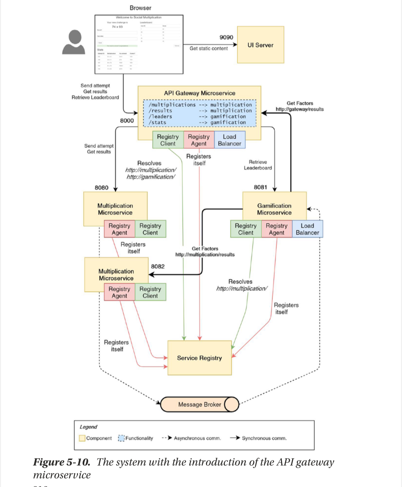

# Microservices with SpringBoot

## Version 6

### Installation & UI Extraction

- By now we would have successfully created our two microservices,
  - [multiplication microservice](./multiplication_service/)
  - [gamification microservice](./gamification_service/)
- And we have employed Event-Driven Strategies to get the two services to communication by sending event using a Topic Exchange, Producer-Subscriber Pattern.
- But, our application's UI is tightly coupled to the multiplication microservice which defeats the purpose of the Microservice Architecture so we will extract the UI from that service and make it stand alone, How?
- We will install a web server(this book used [Jetty 11](https://jetty.org/download.html) so we do too but we can also use Tomcat or Nginx)
- We simply add a new folder called [ui](./ui/), which will serve as the base directory for Jetty to use as configuration layer, separated from the binary files you installed in `/opt`
- Then from within the `ui` folder, this execute this command, which tells Jetty that this folder should be used as it's JETTY_BASE directory:

```bash
    java -jar $JETTY_HOME/start.jar --add-modules=server,http,deploy
```

- Which creates 3 folders:
  - resources
  - start.d
  - webapps
- The `webapps` folder is where we place all our static files(html,css,js) or our _.war/_.jar files. We go to multiplication microservice and copy the static ui files from `/resources` folder to `/webapps/ui` folder.

### Refactorings to Services

- Now we have a new problem after separating, ui is operating from port=9090, mutiplication is operating from port=8080, gamification from port=8081. This leads to a CORS issue because SpringBoot enforces a Same-Origin policy. We fix this by creating configuration files(one in each service) to configure our CORS. After that, out UI can connect to any of the two services with no issues.
- Next we introduce some Javascript logic [gamification-client.js](./ui/webapps/ui/gamification-client.js) to handle communicating with the gamification service to get the data we need from it's endpoints. That data is used to populate a LeaderBoard table and a User Statistics table.

### Issues as at now

- By now our services fully works, in the sense that:

  - You are serving the UI from Jetty, this UI performs REST request/response cycles as its communication paradigm with our services through `hardcoded urls`
  - UI displays an attempt. User solves and submits it. User gets feedback on attempt along with the leaderboard, attempt history table and user stats table becoming visible and populate with data
  - In the backend, the multiplication service sends an event to the gamification service when a user submits and attempt. The gamification checks the attempt and assigns appropriate score and badges based on the boolean field in the attempt's event object. If the gamification needs some data it also performs some request/response communication to the multiplication service for it, with `hardcoded urls`.
    

- The issue with the hardcoded urls for IPC is that:
  - **UI should not be aware of the number of microservices we have**: The UI is now tightly-coupled to one and only one instance of our services which defeats the criterion of loosely-coupled services. The UI knows that there are only two microservices because it is only communicating with just these two. We can't scale our services as we wish because the UI is only aware of one instance each of our microservice based on the hardcoded urls.
  - **HardCoded URLs prevents scaling**: The hardcoded urls means when we scale up/down our services based on load, it would make no difference because the UI will still be communicating with that one service. Each new instance of a service will work on a separate port but here is the case we have tied our UI to one instance's port number hence the other instances are useless unless we manually add these `hostname:port` combination to the UI so it can communicate with these instances as well.

### Solutions to the above

- Service Registry & Discovery
  - We can employ services like `Netflix's Eureka`, `Consul` or `Kubernetes' built-in Service Discovery`. What this will do is that when we spin up more instances of services or decrease them to adjust for load, these instances will be registered for other microservices to automatically discover. Service Discovery is for Backend(service-to-service) communication so this cannot be employed for our frontend-backend communication
- Load Balancing
  - A central point for receiving requests and routing them to their appropriate service instance.
- API Gateway
  - With API gateways, we create a centralized service that will serve as an entry-point for the UI.
  - The gateway also serves as a reverse proxy to route requests to the appropriate service.
  - We can also use this gateway for authentication/authorization checks for all requests since all requests will passthrough this gateway.

#### Service Discovery

- **Service Registry**: Responsible for registering Services and keep track of them using thier alias.
- **Register Agent**: Is used by the services to define it's configurations so they can be found.
- **Register Client**: Contacts the registry for registered services using their alias.
  

- We will deploy this `Service Registry` as a separate mircoservice. The Multiplication and Gamification services will contact this Service Registry as soon as they start to register themselves using their `Register Agent`.
- After that they receive an alias(which is usually the microservice's name, eg: <http://multiplication/>, <http://gamification/>) that can be used to identify them within the registry. The services have a `Register Client` which will take the alias and use it to ask for the url of the registered service inside the `Service Registry`. Basically, the `Service Registry` is like a DNS that keeps registered services and their urls so that when `Registry Client`s come with an alias, they can be given the appropriate url for them to use to connect to their destination service.
- So Gamification's Registry client will contact the Service Registry with the alias of the Multiplication Service and then get _http:localhost:8080_ which will be used by Gamification to contact Multiplication.

#### Client-Side Load Balancing

- Now we have solved the hardcoded Urls aspect by employing `Service Discovery` but we still have an issue, When we spin up multiple instances of the same service how would the UI cbe able to connect to them? The `Registry` registers a service and assigns an alias so multiple instances of the same service will have the same alias(same url) and all these alias still map onto the same url(http:[localhost]:[port]) which was used to register the service at start-up. Now if we spin up multiple instances of the same service(each new instance will obviously operate on a new port) each instance will still be registered with the same name. Now we want to route each request to our multiple instances and for that we will need a Load Balancer, so why Client-Side Load Balancer and not the normal Reverse Proxy(Server-Side LB)?
- Well instead of the Backend deciding which instance to route to, the Frontend will handle that and this works perfectly because we are already using Service Discovery so it just makes sense that we tie the Load Balancer to the Frontend instead of the Backend. So for the load balancer we have a sweet library also from Netflix called `Ribbon`.
- How would this new library integrate with our existing architecture?
  - Say we spin up two instances of the multiplication service, these will be registered in the `Service Registry` as soon as they start up.
  - Then when our Frontend or other Services want to communicate with this service they go to our `Ribbon` who will ask the `Service Registry` for the list of urls that represent his service that we want to talk to.
  - We get a list of urls back and `Ribbon` then decides where to route the request based on the load balancing strategy configured within `Ribbon`.
    

#### Polygot Systems

- A Polyglot system in MicroService Architecture is basically a system where the services can be written in different languages and still work together seamlessly. We can employ yet another library from the Netflix OSS family called `Spring Cloud Netflix Sidecar`. How does Sidecar work?
  - Write your service in the language of your choice, say JavaScript, and boot it up. Operates on a different microservice
  - Start a SpringBoot application that has our `Sidecar` dependency. Operates on a different microservice.
  - Our non-Java application will have it's own `Registry Client` and `Load Balancer`.
  - The Sidecar application will act as a proxy and do the communication on other microservices on our behalf. It will also have a `Registry Client` and `Registry Agent` that talks to our Service Registry.
    

#### API Gateways

- Now we have done quite alot but more needs to be done. As at now the Frontend is very aware of our Backend architecture which isnt good, how does the frontend know? Well bacause our frontend is making HTTP requests to APIs being served from from different port numbers suggesting that our backend is split.
- What we want is to mimic a Monolithic Architecture from the Frontend's POV, meaning that the Frontend has no idea what architectural style our Backend has employed. So instead of making requests to _<http://multiplication/>_, _<http://gamification/>_, ..., _<http://microserviceName/>_ we just make a request to one url _<http://application/>_ and our Backend will handle where to route the request based on some url patterns.
- How can we handle this? We go to Netflix OSS family once more, for the library `Spring Cloud Netflix Zuul` or another called `Spring Cloud Gateway`.
- In our application we will introduce our `API Gateway` and a `Routing table` via `Zuul`. The Routing table is basically a table that maps the url coming in from the Frontend to an appropriate backend server/service. The API Gateway may be placed in front of several Load Balancer that handle load distribution to our Service instances. As usual, this new Gatway will exist as a microservice.
  

#### Eureka, Ribbon and Zuul at work

- `Zuul` gets a request. Zuul checks the request url pattern(eg: /random) which will map onto an alias in the Routing Table.
- `Eureka` is asked, by Zuul, for the list of services in it's Registry that have the same alias. Eureka returns the list.
- `Ribbon` takes the list and returns one url based on it's load balancing strategy.
- `Zuul` takes over and redirects to that location.
- Now within our application, our gamification service can either go to our API gateway with it's requests to the multiplication service or it can use it's internally configured `Registry Client from Eureka` and `Load Balancer from Ribbon`:
  - Getting the services to talk through the API Gateway is the better option but it does introduce an issue, `Edge Service` which would represent a Single-Point of Failure since the Gateway is only one. We can improve this by spinning multiple instances of the Gateway when load increases in our system but for normal operation we will need to introduce Redundancy for the Gateway by having another instance of the Gateway on standby.
  - So the individual services will use their `Registry Client` and `Load Balancer` to locate the API Gateways instead of other services and the Load Balancer will chose which Gateway url to use.
    

## Version 7

### Implementing API Gateway with ~~Zuul(deprecated)~~ Spring Cloud Gateway

- We start this of with a new Springboot application with the Zuul dependency.

```xml
    <!-- Using Spring Cloud Gateway instead of Zuul because Zuul is deprecated -->
  <dependency>
      <groupId>org.springframework.cloud</groupId>
      <artifactId>spring-cloud-starter-gateway</artifactId>
      <version>4.1.5</version>
  </dependency>
```

- We will call it [gateway](./gateway/)
- We change `application.properties` to `application.yml` for better readability.
- Dont forget to configure the CORS policy in the configuration folder like you did for the other services.
- Inside our yml file:
  - We set the server port number
  - Set the spring.cloud.routes which is a list:
    - **id** will be an arbitrary name to be used to identify this route pattern
    - **uri** will be the location to route the request to. _eg: <http://localhost:8080>_
    - **predicate** is the uri request pattern to match to the incoming request \*eg: Path=/api/fish/\*\*\*
    - **filters** some logic to apply to the incoming url to manipulate it as we see fit, _eg: ReWritePath=/api(?<remaining>/._), ${remaining}\* will remove the /api from the incoming url and reconstruct the url using the remaining. so a request url of <http://localhost:8000/api/multiplications/>**will become <http://localhost:8080/multiplications/>**
- Now we go to the UI folder and find the places we are making requests to the services and change the urls to <http://localhost:8000>. Same for the services, with this, all requests will have a centralized handler, our gateway.

- Let’s summarize the steps to make our system work once more:
  1. Run the RabbitMQ server (if it’s not yet running in the background).
  2. Run the gateway microservice.
  3. Run the multiplication microservice.
  4. Run the gamification microservice.
  5. Run the Jetty web server from the ui root folder.

## Version 8

### Implementing Service Discovery with Eureka

- Now that we are sure that our Gatewa works perfectly, it's time to create our Service Registry by spinning up a Service Discovery Server with Eureka Server.
- This Server will exist in it's own Microservice which we can scale and make highly available as we see fit.
- Our dependency:

```xml
  <dependency>
   <groupId>org.springframework.cloud</groupId>
   <artifactId>spring-cloud-starter-netflix-eureka-server</artifactId>
  </dependency>
```

- Then go to the application entry point and annotate it with `@EnableEurekaServer`
- We can run our Registry Server now but it is not connected to anything. No clients coming in to communicate, we fix this by introducing a Eureka Client to all our Microservices.
- For our individual miroservices:
  1. We introduce a dependency management block to resolve the Spring Cloud dependencies

```xml
 <dependencyManagement>
  <dependencies>
   <dependency>
    <groupId>org.springframework.cloud</groupId>
    <artifactId>spring-cloud-starter-parent</artifactId>
    <version>${spring-cloud.version}</version>
    <type>pom</type>
    <scope>import</scope>
   </dependency>
  </dependencies>
 </dependencyManagement>
```

2. A new property to reference the Spring Cloud's version.

```xml
<properties>
  <java.version>23</java.version>
  <spring-cloud.version>2023.0.3</spring-cloud.version>
</properties>
```

3. The dependency to include to enable the Service Registry Client.

```xml
<dependency>
      <groupId>org.springframework.cloud</groupId>
      <artifactId>spring-cloud-starter-netflix-eureka-client</artifactId>
  </dependency>
```

4. An extra dependency for spring actuator which will contantly send it's healthcheck to the Service Registry to show it's still operational.

```xml
<dependency>
   <groupId>org.springframework.boot</groupId>
   <artifactId>spring-boot-starter-actuator</artifactId>
</dependency>
```

5. Then inside application.properties or application.yml, you define the url of the Service Registry:

```txt
eureka.client.service-url.defaultZone=http://localhost:8761/eureka
```

- Repeat the above for all the microservices and then for the gateway microservice because you want the gateway to register itself in the Service Registrya and also find other microservices.
- Start your services now. While running Eureka servers, we often run into exceptions like:

```bash
com.netflix.discovery.shared.transport.TransportException: Cannot execute request on any known server
```

- Fix it by adding this to the application.properties/yml file:

```txt
eureka.client.register-with-eureka=false
eureka.client.fetch-registry=false
```

- Why does it show up? Well, Eureka Server also comes packaged with an internal Eureka Client so when you try to start the Server, the Client also registers itself and begins to query the registry that doesn't yet exist. We disable this by setting the flags to false.
- We can still can an error in our Eureka Dashboard about Renews Threshold being below Renews and we can solve this by adding this to our service registry's application.properties file:

```txt
eureka.server.renewal-percent-threshold=0.49
```

- Then to solve our CORS issues in Gateway service we set it's application.yml as [this](./gateway/src/main/resources/application.yml)

#### Databases & Stateless Services

Session Affinity:

```md
## Session Affinity

Session affinity, also known as "sticky sessions," is a concept used in microservices and distributed systems to ensure that requests from a particular client are always directed to the same instance of a service.

## Why Use Session Affinity?

In stateless microservices architectures, services are designed to handle any incoming request regardless of previous interactions. However, some use cases require maintaining a session state across multiple interactions with the client, such as user-specific data, shopping carts, or ongoing transactions. Session affinity helps achieve this by routing all client requests to the same service instance during a session.

## Alternatives to Session Affinity

1. **Token-Based Authentication**: Using stateless tokens like JWT (JSON Web Tokens) allows client state to be stored on the client side and validated by any service instance.
2. **Distributed Caching**: Services can use a distributed cache (e.g., Redis) to store state that can be accessed by any instance.
3. **Sticky Session Patterns with Service Mesh**: Tools like Istio and Linkerd can help manage traffic routing and stickiness at the service mesh level, abstracting some of the complexities.

## Example Use Case

A microservice application for an e-commerce site uses session affinity to ensure that a customer's cart state is preserved during their session. As they add items, the requests are routed to the same instance, reducing state consistency issues. If session state is stored in a distributed cache, it helps balance scaling needs while maintaining stickiness for session-related data.
```

- In our current architecture, the database is embedded in our backend application, this would cause scalability issues because every instance of the same service will have it's own database, that shouldn't be the case. All instances need to keep their data in the same shared database.
- H2 database can operate in both `embedded mode` and `server mode`, Server mode allows for the H2 database to get connections from multiple server, basically we get a shared database.
- We can set a flag by adding a suffix to enable automatic mixed mode:

```yml
AUTO_SERVER=TRUE

adding to both the gamification and multiplication jdbc urls:
spring.datasource.url=jdbc:h2:file:~/Documents/microservices_with_springboot/gamification;DB_CLOSE_ON_EXIT=FALSE;AUTO_SERVER=TRUE
```

- With this small change, the database can scale but it is only just one instance of the database. To create multiple instances of the database, we can choose a databae engine that would allow us to create clusters at the database tier. We then get the cluster url and replace it with the datasource.url, this would be essential in production but for now we can keep the system simple and reduce complexity.
- Now that the Database tier has been taken care of, what happens to the events? Well now we can spin up multiple instances of multiplicationa and gamification, the pipeline of attempt-to-points involves RabbitMQ publishing an event when an attempt comes in for the gamification service to consume and assign points/badges. So if we have multiple instances of gamification, which instance takes the event to work with? Will the other instances receive the event? Will there be conflicts?

```md
1. Only one instance of the gamification service handles each event at a time, avoiding conflicts.
2. RabbitMQ automatically handles distribution and load-balancing of messages among multiple instances.
3. Unprocessed or failed messages can be requeued for other instances to handle, ensuring the event is not lost.
```


- Next we start up all the instances of our application and spin up an extra instance for the multiplication service by running this:

```bash
$ ./mvnw spring-boot:run -Dspring-boot.run.arguments="--server.port=8180"
```

- Spring Cloud Gateway automatically takes care of the LoadBalancing for us. By default it routes request to the two instances using the RoundRobin strategy. But we have a problem, when you shut down one of the instances, the gateway still routes request to that instance leading to issues so we have to make some configuration to take care of that.
- Currently the load balancer doesn't verify if the service instance is alive or not before routing traffic to it. Normally, this would make sense because the responsibility of registering and evicting services from the system falls on Eureka but Eureka is slow, it runs it's eviction policy after some minutes(~3 minutes), all this while the LoadBalancer routes traffic to a dead instance.
- Spring Cloud Gateway comes, out-the-box, with Spring Cloud LoadBalancer and to configure it just add this to the gateway's application.yml:

```yml
spring:
  cloud:
    loadbalancer:
      configurations: health-check
```

- The above takes care of the health-checks, if you want to configure the LoadBalancing strategy then inside the configuration folder, you create a file and add this, this changes the from the default RoundRobin strategy to a Random one:

```java
import org.springframework.cloud.loadbalancer.core.RandomLoadBalancer;
import org.springframework.cloud.loadbalancer.support.LoadBalancerClientFactory;
import org.springframework.context.annotation.Bean;
import org.springframework.context.annotation.Configuration;

@Configuration
public class CustomLoadBalancerConfiguration {

    @Bean
    public RandomLoadBalancer randomLoadBalancer(LoadBalancerClientFactory clientFactory) {
        String serviceId = clientFactory.getName(); // Retrieves the current service ID.
        return new RandomLoadBalancer(clientFactory.getLazyProvider(serviceId, ServiceInstanceListSupplier.class), serviceId);
    }
}

```

#### Circuit Breaker

- Now our application works well with Spring Cloud Gateway, Eureka and Spring Cloud LoadBalancer and we can scale effeciently but we still have issues. As seen in the previous step, when an instance goes down, it breaks our entire application, this isn't good. We can solve this by implementing a Crcuit Breaker mechanism.
- This works by isolating instance failures and preventing the Gateway from routing requests to it, giving the failing instance some time to recover/be repaired.
- To implement a fallback mechanism on the Gateway, simply add this to the gateway's application.yml:

```yml
spring:
  cloud:
    gateway:
      default-filters:
        - name: CircuitBreaker
          args:
            name: defaultCircuitBreaker
            fallbackUri: forward:/defaultFallback
```

- To account for situations where the gamification can not reach the multiplication(because the service is down), we add a Circuit Breaker on Gamification and configure an endpoint in Multiplication for this:
- Add dependency in Gamification:

```xml
<dependency>
    <groupId>org.springframework.cloud</groupId>
    <artifactId>spring-cloud-starter-circuitbreaker-resilience4j</artifactId>
</dependency>

```

- Gamification communicates with Multiplication through an API endpoint, so we add a fallback method inside our Gamification RestTemplate client to mimic the return of that method for Resilience to use:

```java
  @CircuitBreaker(name = "multiplicationAttempt", fallbackMethod = "getAttemptByIdFallback")
  @Override
  public MultiplicationAttempt getAttemptById(Long attemptId) {
      return restTemplate.getForObject(multiplicationHost + "/results/" + attemptId, MultiplicationAttempt.class);
  }


  public MultiplicationAttempt getAttemptByIdFallback(Long attemptId){
      return new MultiplicationAttempt("NoUser", 0, 0, 0, true);
  }
```

- Then we configure Resilience$j in the yml file:
- This configuration ensures:
  - The circuit breaker evaluates the last 10 calls.
  - At least 5 calls are required for the circuit breaker to be triggered.
  - If the failure rate is 50% or higher, the circuit breaker will open.

```yml
resilience4j:
  circuitbreaker:
    instances:
      multiplication:
        registerHealthIndicator: true
        slidingWindowSize: 10
        minimumNumberOfCalls: 5
        failureRateThreshold: 50
        waitDurationInOpenState: 10s
        permittedNumberOfCallsInHalfOpenState: 3
        automaticTransitionFromOpenToHalfOpenEnabled: true
```
