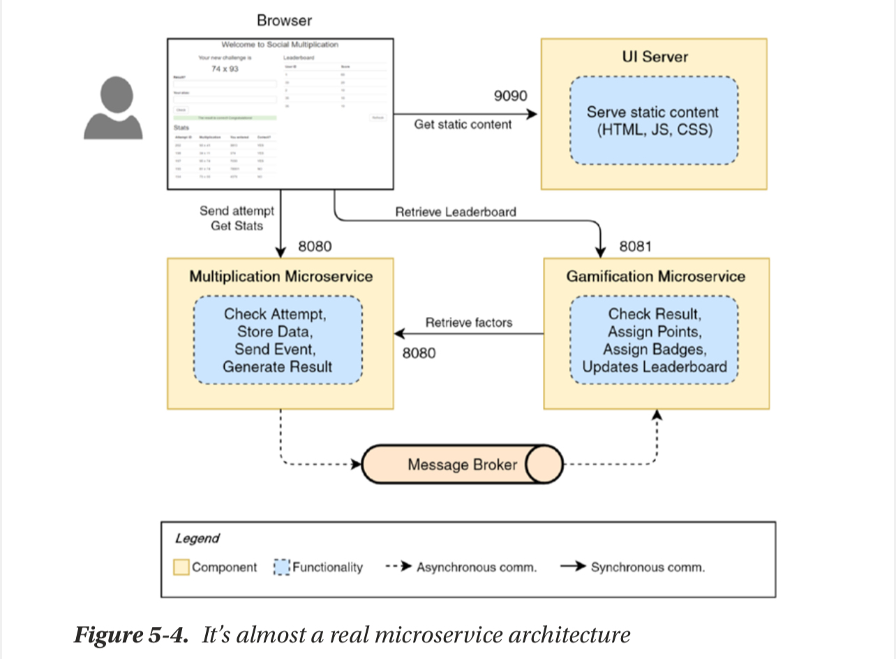
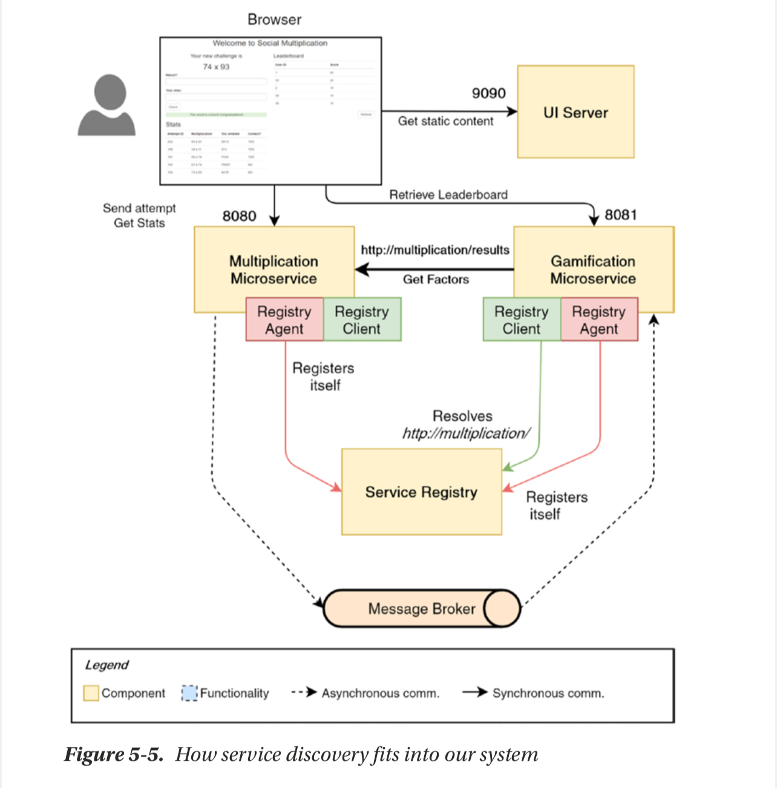
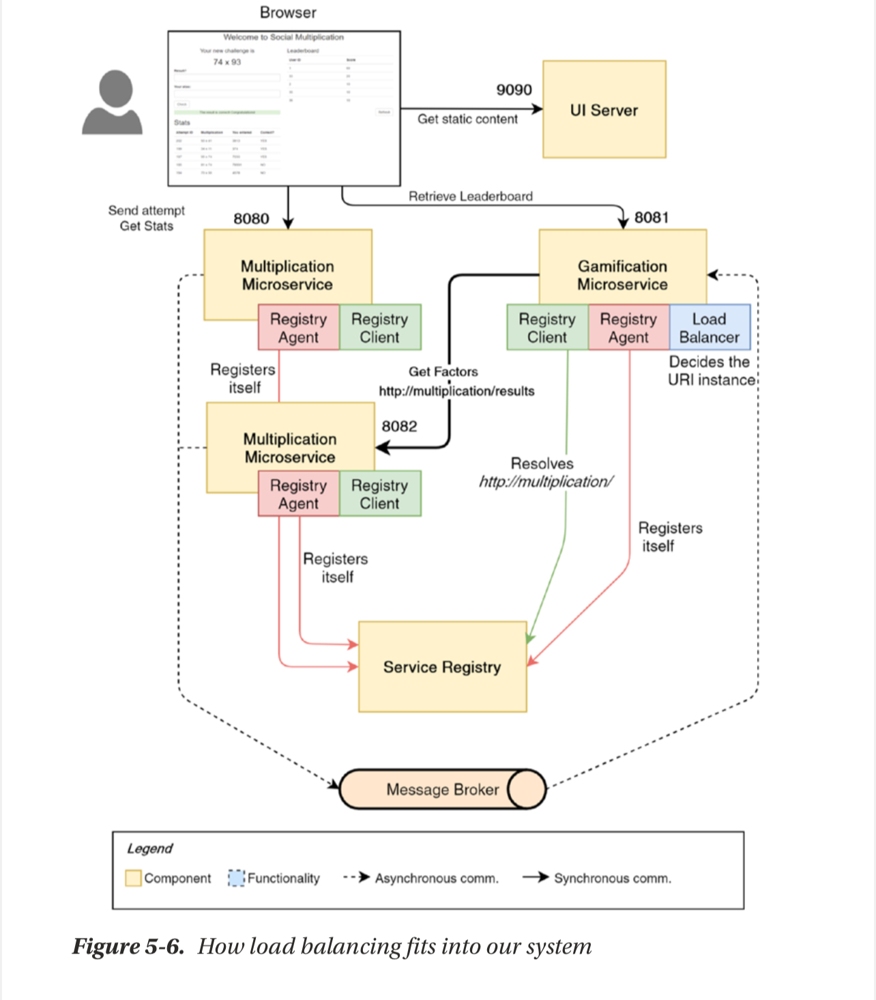
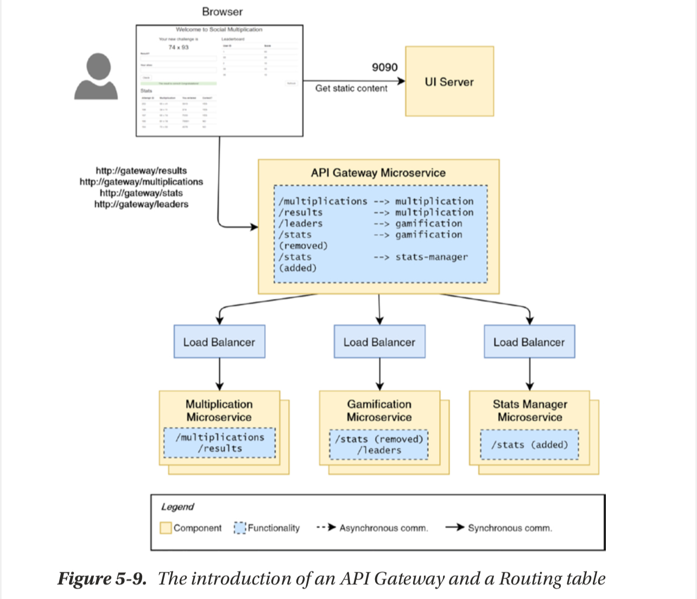

# Microservices with SpringBoot

## Version 6

### Installation & UI Extraction

- By now we would have successfully created our two microservices,
  - [multiplication microservice](./multiplication_service/)
  - [gamification microservice](./gamification_service/)
- And we have employed Event-Driven Strategies to get the two services to communication by sending event using a Topic Exchange, Producer-Subscriber Pattern.
- But, our application's UI is tightly coupled to the multiplication microservice which defeats the purpose of the Microservice Architecture so we will extract the UI from that service and make it stand alone, How?
- We will install a web server(this book used [Jetty 11](https://jetty.org/download.html) so we do too but we can also use Tomcat or Nginx)
- We simply add a new folder called [ui](./ui/), which will serve as the base directory for Jetty to use as configuration layer, separated from the binary files you installed in `/opt`
- Then from within the `ui` folder, this execute this command, which tells Jetty that this folder should be used as it's JETTY_BASE directory:

```bash
    java -jar $JETTY_HOME/start.jar --add-modules=server,http,deploy
```

- Which creates 3 folders:
  - resources
  - start.d
  - webapps
- The `webapps` folder is where we place all our static files(html,css,js) or our *.war/*.jar files. We go to multiplication microservice and copy the static ui files from `/resources` folder to `/webapps/ui` folder.

### Refactorings to Services

- Now we have a new problem after separating, ui is operating from port=9090, mutiplication is operating from port=8080, gamification from port=8081. This leads to a CORS issue because SpringBoot enforces a Same-Origin policy. We fix this by creating configuration files(one in each service) to configure our CORS. After that, out UI can connect to any of the two services with no issues.
- Next we introduce some Javascript logic [gamification-client.js](./ui/webapps/ui/gamification-client.js) to handle communicating with the gamification service to get the data we need from it's endpoints. That data is used to populate a LeaderBoard table and a User Statistics table.

### Issues as at now

- By now our services fully works, in the sense that:
  - You are serving the UI from Jetty, this UI performs REST request/response cycles as its communication paradigm with our services through `hardcoded urls`
  - UI displays an attempt. User solves and submits it. User gets feedback on attempt along with the leaderboard, attempt history table and user stats table becoming visible and populate with data
  - In the backend, the multiplication service sends an event to the gamification service when a user submits and attempt. The gamification checks the attempt and assigns appropriate score and badges based on the boolean field in the attempt's event object. If the gamification needs some data it also performs some request/response communication to the multiplication service for it, with `hardcoded urls`.


- The issue with the hardcoded urls for IPC is that:
  - **UI should not be aware of the number of microservices we have**: The UI is now tightly-coupled to one and only one instance of our services which defeats the criterion of loosely-coupled services. The UI knows that there are only two microservices because it is only communicating with just these two. We can't scale our services as we wish because the UI is only aware of one instance each of our microservice based on the hardcoded urls.
  - **HardCoded URLs prevents scaling**: The hardcoded urls means when we scale up/down our services based on load, it would make no difference because the UI will still be communicating with that one service. Each new instance of a service will work on a separate port but here is the case we have tied our UI to one instance's port number hence the other instances are useless unless we manually add these `hostname:port` combination to the UI so it can communicate with these instances as well.

### Solutions to the above

- Service Registry & Discovery
  - We can employ services like `Netflix's Eureka`, `Consul` or `Kubernetes' built-in Service Discovery`. What this will do is that when we spin up more instances of services or decrease them to adjust for load, these instances will be registered for other microservices to automatically discover. Service Discovery is for Backend(service-to-service) communication so this cannot be employed for our frontend-backend communication
- Load Balancing
  - A central point for receiving requests and routing them to their appropriate service instance.
- API Gateway
  - With API gateways, we create a centralized service that will serve as an entry-point for the UI.
  - The gateway also serves as a reverse proxy to route requests to the appropriate service.
  - We can also use this gateway for authentication/authorization checks for all requests since all requests will passthrough this gateway.

#### Service Discovery

- **Service Registry**: Responsible for registering Services and keep track of them using thier alias.
- **Register Agent**: Is used by the services to define it's configurations so they can be found.
- **Register Client**: Contacts the registry for registered services using their alias.


- We will deploy this `Service Registry` as a separate mircoservice. The Multiplication and Gamification services will contact this Service Registry as soon as they start to register themselves using their `Register Agent`. 
- After that they receive an alias(which is usually the microservice's name, eg: <http://multiplication/>, <http://gamification/>) that can be used to identify them within the registry. The services have a `Register Client` which will take the alias and use it to ask for the url of the registered service inside the `Service Registry`. Basically, the `Service Registry` is like a DNS that keeps registered services and their urls so that when `Registry Client`s come with an alias, they can be given the appropriate url for them to use to connect to their destination service.
- So Gamification's Registry client will contact the Service Registry with the alias of the Multiplication Service and then get *http:localhost:8080* which will be used by Gamification to contact Multiplication.

#### Client-Side Load Balancing

- Now we have solved the hardcoded Urls aspect by employing `Service Discovery` but we still have an issue, When we spin up multiple instances of the same service how would the UI cbe able to connect to them? The `Registry` registers a service and assigns an alias so multiple instances of the same service will have the same alias(same url) and all these alias still map onto the same url(http:[localhost]:[port]) which was used to register the service at start-up. Now if we spin up multiple instances of the same service(each new instance will obviously operate on a new port) each instance will still be registered with the same name. Now we want to route each request to our multiple instances and for that we will need a Load Balancer, so why Client-Side Load Balancer and not the normal Reverse Proxy(Server-Side LB)? 
- Well instead of the Backend deciding which instance to route to, the Frontend will handle that and this works perfectly because we are already using Service Discovery so it just makes sense that we tie the Load Balancer to the Frontend instead of the Backend. So for the load balancer we have a sweet library also from Netflix called `Ribbon`. 
- How would this new library integrate with our existing architecture?
  - Say we spin up two instances of the multiplication service, these will be registered in the `Service Registry` as soon as they start up.
  - Then when our Frontend or other Services want to communicate with this service they go to our `Ribbon` who will ask the `Service Registry` for the list of urls that represent his service that we want to talk to.
  - We get a list of urls back and `Ribbon` then decides where to route the request based on the load balancing strategy configured within `Ribbon`.


#### Polygot Systems

- A Polyglot system in MicroService Architecture is basically a system where the services can be written in different languages and still work together seamlessly. We can employ yet another library from the Netflix OSS family called `Spring Cloud Netflix Sidecar`. How does Sidecar work?
  - Write your service in the language of your choice, say JavaScript, and boot it up. Operates on a different microservice
  - Start a SpringBoot application that has our `Sidecar` dependency. Operates on a different microservice.
  - Our non-Java application will have it's own `Registry Client` and `Load Balancer`.
  - The Sidecar application will act as a proxy and do the communication on other microservices on our behalf. It will also have a `Registry Client` and `Registry Agent` that talks to our Service Registry.


#### API Gateways

- Now we have done quite alot but more needs to be done. As at now the Frontend is very aware of our Backend architecture which isnt good, how does the frontend know? Well bacause our frontend is making HTTP requests to APIs being served from from different port numbers suggesting that our backend is split.
- What we want is to mimic a Monolithic Architecture from the Frontend's POV, meaning that the Frontend has no idea what architectural style our Backend has employed. So instead of making requests to *http://multiplication/*, *http://gamification/*, ..., *http://microserviceName/* we just make a request to one url *http://application/* and our Backend will handle where to route the request based on some url patterns.
- How can we handle this? We go to Netflix OSS family once more, for the library `Spring Cloud Netflix Zuul` or another called `Spring Cloud Gateway`.
- In our application we will introduce our `API Gateway` and a `Routing table` via `Zuul`. The Routing table is basically a table that maps the url coming in from the Frontend to an appropriate backend server/service. The API Gateway may be placed in front of several Load Balancer that handle load distribution to our Service instances. As usual, this new Gatway will exist as a microservice.


#### Eureka, Ribbon and Zuul at work

- `Zuul` gets a request. Zuul checks the request url pattern(eg: /random) which will map onto an alias in the Routing Table.
- `Eureka` is asked, by Zuul, for the list of services in it's Registry that have the same alias. Eureka returns the list.
- `Ribbon` takes the list and returns one url based on it's load balancing strategy.
- `Zuul` takes over and redirects to that location.
